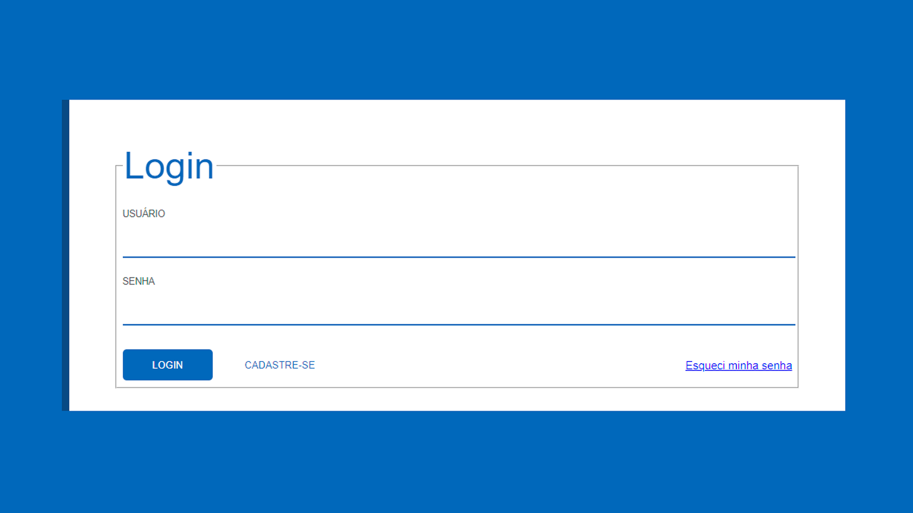

Login - Sign Up is a study project focused on designing and implementing login and sign-up screens using HTML and CSS. The project explores the use of labels, inputs, and buttons to create user-friendly authentication interfaces. It helped me improve my understanding of form structures and UI styling for login systems.

**[See Page](https://luigineryproject5.netlify.app)**  

